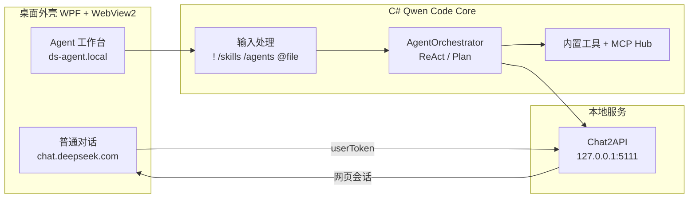

# DeepSeek Desktop

将 [DeepSeek 网页版](https://chat.deepseek.com) 封装为 Windows 桌面应用，并内置 **Agent 工作台**（Qwen Code Core 的 C# 移植 + MCP + Skills / Subagents）。

> **免责声明：** 本项目为第三方开源工具，与 DeepSeek、Qwen / Qwen Code、以及各类 Chat2API 上游项目均无隶属或合作关系。使用前请阅读下方 [免责声明](#免责声明) 全文。

---

## 功能亮点

| 模块 | 说明 |
|------|------|
| **普通对话** | 嵌入官方 `chat.deepseek.com`，保留网页登录、深度思考、联网搜索等能力 |
| **Agent 模式** | 独立工作台页面，通过本地 Chat2API 调用已登录的网页会话进行推理 |
| **Qwen Code Core** | 参考 [@qwen-code/qwen-code](https://www.npmjs.com/package/@qwen-code/qwen-code) v0.14.5，在 C# 中实现 Core 工具链（**不启动** `qwen.cmd` 子进程） |
| **MCP** | 可连接多个 Model Context Protocol 服务，与内置工具统一调度 |
| **Skills / Subagents** | 兼容 `.qwen/skills`、`~/.qwen/skills`、`.qwen/agents` 配置目录 |
| **本地 OpenAI 兼容 API** | 默认 `http://127.0.0.1:5111/v1`，便于对接其他工具 |
| **工具审批** | 读操作可自动放行，写入 / Shell 需确认（可配置） |
| **会话存储** | Agent 对话本地持久化，支持容量与保留天数策略 |

---

## 截图与模式

- **普通对话**：官网体验 + 悬浮模式切换按钮  
- **Agent · ReAct**：单 Agent 循环（Thought → Action → Observation → Final Answer）  
- **计划 · 子 Agent**：先规划步骤，再按步骤委派子 Agent 执行  

---

## 快速开始

### 环境

- Windows 10 / 11（x64）
- [.NET 10 SDK](https://dotnet.microsoft.com/download)
- [Microsoft Edge WebView2 运行时](https://developer.microsoft.com/microsoft-edge/webview2/)

### 构建与运行

```powershell
git clone https://github.com/fanstars2318/deepseek-desktop.git
cd deepseek-desktop

# 编译并输出到桌面 DeepSeek-Edge 文件夹（含快捷方式）
.\build.ps1

# 运行
.\publish\DeepSeek.exe
# 或桌面目录：%USERPROFILE%\Desktop\DeepSeek-Edge\DeepSeek.exe
```

仅发布到 `publish/` 目录：

```powershell
dotnet publish -c Release -r win-x64 --self-contained false -o publish
```

### 首次使用

1. 启动应用，在 **普通对话** 中登录 DeepSeek 网页账号。  
2. 点击右上角 **Agent** 切换到智能体工作台。  
3. 在设置中配置 MCP 服务器、工作区路径、审批模式等（托盘 / 页面内「MCP 设置」）。  

---

## Agent 命令速查

在 Agent 输入框中可使用（与 Qwen Code CLI 习惯对齐）：

| 命令 | 作用 |
|------|------|
| `/help` | 显示帮助 |
| `/clear` | 清空当前对话 |
| `/react` | 切换为 ReAct 单 Agent |
| `/plan` | 切换为计划 + 子 Agent |
| `/chat` | 返回普通网页对话 |
| `/skills` | 列出可用 Skills |
| `/skills <名> [任务]` | 加载 Skill 并执行任务 |
| `/agents` | 列出命名 Subagents |
| `/agents <名> <任务>` | 委派指定 Subagent |
| `!<命令>` | 直接执行 Shell（不经模型，需审批） |
| `@相对路径/文件` | 将工作区内文件注入上下文 |

---

## Skills 与 Subagents 配置

与官方 Qwen Code 目录约定一致：

```
<工作区>/
  .qwen/
    skills/
      <skill-name>/
        SKILL.md          # YAML frontmatter + 说明正文
    agents/
      <agent-name>.md     # YAML frontmatter + 系统提示词

~/.qwen/skills/           # 用户级 Skills
~/.qwen/agents/           # 用户级 Subagents
```

可选：若本机安装了 `npm i -g @qwen-code/qwen-code`，可扫描其 `bundled/` 内置 Skills（在配置中开关 `EnableQwenBundledSkills`）。

---

## 内置 Core 工具

与 Qwen Code 官方工具名一致：

`read_file` · `write_file` · `edit` · `list_directory` · `glob` · `grep_search` · `run_shell_command` · `web_fetch`

MCP 工具以 `serverId__toolName` 形式暴露给模型。

---

## 架构概览



---

## 配置与数据目录

| 路径 | 内容 |
|------|------|
| `%LocalAppData%\DeepSeekEdge\config.json` | 登录 Token、MCP、工作区、功能开关 |
| `%LocalAppData%\DeepSeekEdge\agent-sessions\` | Agent 对话记录 |
| `%LocalAppData%\DeepSeekEdge\User Data\` | WebView2 用户数据 |

主要配置项见 `Models/AppConfig.cs`（工作区、审批模式、Skills/Subagents 开关、会话清理策略等）。

---

## 项目结构

```
deepseek-desktop/
├── Assets/
│   ├── inject/          # 官网页脚本注入（bridge、overlay）
│   └── agent/           # Agent 工作台前端
├── Services/
│   ├── QwenCode/        # Qwen Code Core C# 移植
│   ├── DesktopAgentHost.cs
│   └── LocalOpenAiServer.cs
├── Views/               # WPF 设置、审批、运行日志窗口
├── build.ps1            # 一键发布到桌面
└── DeepSeekBrowser.csproj
```

---

## 技术栈

- **.NET 10** · **WPF** · **WebView2**
- **Model Context Protocol**（`ModelContextProtocol` NuGet）
- 参考 **Qwen Code** 架构与工具命名，推理走 **DeepSeek 网页 Chat API**

---

## 常见问题

**Agent 页提示「请先在普通对话中登录」？**  
先在普通对话完成网页登录，再切 Agent；登录态会同步到本地 `config.json`。

**Git 推送失败？**  
若无法直连 GitHub，可配置系统代理后推送，例如：`git -c http.proxy=http://127.0.0.1:7890 push`。

**与 npm 版 Qwen Code 的关系？**  
本仓库将官方 Core 能力移植进 C#，由 DeepSeek 桌面 Agent 作为外壳；默认**不**通过子进程调用 `qwen` CLI。

---

## 相关链接

- 仓库：https://github.com/fanstars2318/deepseek-desktop  
- [Qwen Code 架构文档](https://qwenlm.github.io/qwen-code-docs/zh/developers/architecture/)  
- [Qwen Code 自适应 Token 扩容设计](https://qwenlm.github.io/qwen-code-docs/zh/design/adaptive-output-token-escalation/adaptive-output-token-escalation-design/)  

---

## 免责声明

**请在使用、分发或二次开发本软件前仔细阅读。** 若你不同意下列条款，请勿使用本仓库及由此构建的任何程序。

### 1. 项目性质

- **DeepSeek Desktop**（本仓库）由社区开发者维护，**不是** DeepSeek、深度求索或其关联公司的官方客户端、插件或授权产品。
- 本软件按「现状」提供，**不提供任何明示或暗示的保证**（包括但不限于适销性、特定用途适用性、持续可用性、无错误等）。
- 作者与贡献者不对因使用本软件导致的任何直接、间接、附带、特殊或后果性损害承担责任（包括数据丢失、账号受限、设备损坏、业务中断等）。

### 2. DeepSeek 相关

- 「DeepSeek」及相关标识、商标、服务归 **DeepSeek / 深度求索** 及其权利人所有；本仓库仅在说明集成方式时作技术性引用，**不享有任何商标权或商业授权**。
- 普通对话模式通过 WebView2 加载 **DeepSeek 官方网站**（`chat.deepseek.com`）；你须自行在官网注册、登录并遵守其 **[用户协议](https://chat.deepseek.com)**、隐私政策及当时有效的服务规则。
- Agent 模式在本地将请求转发至你已登录的 **网页会话接口**（非 DeepSeek 官方对外发布的独立 Open API 产品文档路径）；DeepSeek 有权随时调整网页接口、鉴权方式或访问策略，**不保证**本软件长期可用。
- 请勿将本软件用于违反法律法规、侵犯他人权益、批量滥用、绕过平台限制、未授权爬取或任何 DeepSeek 服务条款禁止的行为；**由此产生的一切后果由使用者自行承担**。

### 3. Qwen Code 相关

- 本仓库 Agent 能力参考开源项目 **[Qwen Code](https://github.com/QwenLM/qwen-code)**（npm：`@qwen-code/qwen-code`）的 **架构、工具命名与 Skills / Subagents 目录约定**，在 C# 中进行了**独立实现与移植**。
- 本软件 **不是** 阿里巴巴、通义千问（Qwen）或 Qwen Code 团队的官方产品；**不** 通过子进程调用官方 `qwen` CLI，也 **不** 代表 Qwen Code 官方对实现方式、安全性或合规性的认可。
- Qwen、通义千问、Qwen Code 等名称及相关知识产权归其各自权利人所有；文档与代码中的引用仅用于技术说明。
- 若你启用「扫描本机 npm 安装目录下的 bundled Skills」等功能，相关 Skill 内容版权归其原作者所有；请另行遵守对应许可与使用条件。
- 因参考实现与官方版本存在差异，**功能对等性、稳定性与兼容性不作保证**；请勿在未经评估的生产或关键业务环境中直接依赖。

### 4. Chat2API 相关

- 文档与界面中的 **「Chat2API」** 指：本应用在本地提供的 **OpenAI 兼容 HTTP 接口**（默认 `http://127.0.0.1:5111/v1`），在已登录 DeepSeek 网页的前提下，将 Agent 请求映射为对 **网页端 Chat API** 的调用方式（与社区常见的 Chat2API / 网页转 API 思路同类）。
- 本仓库 **未必** 包含、捆绑或等同于 GitHub 上某一特定名为「Chat2API」的独立开源项目；若你同时使用其他 Chat2API 实现，请区分其来源、配置与安全风险。
- **将网页会话转换为 API 调用的行为可能违反目标平台的服务条款或风控策略**；是否允许以 API 方式调用、是否存在频率或用途限制，以 DeepSeek 官方规则为准。本软件 **不鼓励** 用于商业转售 API、批量代理、规避付费或任何未经授权的第三方接入。
- 网页 Token、`userToken` 等凭证存储于本机（如 `%LocalAppData%\DeepSeekEdge\config.json`），**由使用者自行保管**；请勿提交到公开仓库、截图传播或共享给他人。
- 作者与贡献者 **不对** 因使用 Chat2API 类能力导致的账号封禁、限流、法律纠纷或第三方索赔承担任何责任。

### 5. MCP、Shell 与本地工具

- MCP 服务器、Shell 命令、文件读写等能力可能在本地执行 **高权限操作**；启用前请确认工具来源可信，并在「工具审批」中谨慎授权。
- 工作区路径、命令执行范围由配置决定；**误操作可能导致数据被修改或删除**，请自行备份重要文件。

### 6. 开源与贡献

- 本仓库源代码依仓库所标注的开源许可证授权（若未单独声明，以仓库根目录 LICENSE 或提交记录为准）；**许可证不延伸** 至 DeepSeek、Qwen Code、Chat2API 等第三方服务或商标。
- 向本仓库贡献代码即表示你确认拥有相应权利，且贡献内容不侵犯第三方权益。

**继续使用本软件，即视为你已阅读、理解并同意上述免责声明。**

---

## 开源说明

欢迎 Issue / PR。提交前请确保不包含个人 Token 或 `config.json` 等敏感文件。

---

<p align="center">
  <sub>如果这个项目对你有帮助，欢迎 Star ⭐</sub>
</p>
