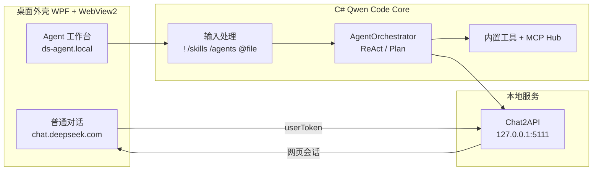

# DeepSeek Desktop

将 [DeepSeek 网页版](https://chat.deepseek.com) 封装为 Windows 桌面应用，并内置 **Agent 工作台**（Qwen Code Core 的 C# 移植 + MCP + Skills / Subagents）。

> **免责声明：** 本仓库为第三方独立开源项目，与 DeepSeek、Qwen Code（@qwen-code/qwen-code）及任何 Chat2API 相关项目**无隶属、无授权、无背书关系**。使用本软件须自行遵守各第三方服务条款与适用法律；软件按「原样」提供，维护者不承担因使用产生的责任。详见 **[DISCLAIMER.md](./DISCLAIMER.md)**。

---

## 功能亮点

| 模块 | 说明 |
|------|------|
| **普通对话** | 嵌入官方 `chat.deepseek.com`，保留网页登录、深度思考、联网搜索等能力 |
| **Agent 模式** | 独立工作台页面，通过本地 Chat2API 调用已登录的网页会话进行推理 |
| **Qwen Code Core** | 参考 [@qwen-code/qwen-code](https://www.npmjs.com/package/@qwen-code/qwen-code) v0.14.5，在 C# 中实现 Core 工具链（**不启动** `qwen.cmd` 子进程） |
| **MCP** | 可连接多个 Model Context Protocol 服务，与内置工具统一调度 |
| **Skills / Subagents** | 兼容 `.qwen/skills`、`~/.qwen/skills`、`.qwen/agents` 配置目录 |
| **本地 OpenAI 兼容 API** | 默认 `http://127.0.0.1:5111/v1`，便于对接其他工具 |
| **工具审批** | 读操作可自动放行，写入 / Shell 需确认（可配置） |
| **会话存储** | Agent 对话本地持久化，支持容量与保留天数策略 |

---

## 截图与模式

- **普通对话**：官网体验 + 悬浮模式切换按钮  
- **Agent · ReAct**：单 Agent 循环（Thought → Action → Observation → Final Answer）  
- **计划 · 子 Agent**：先规划步骤，再按步骤委派子 Agent 执行  

---

## 快速开始

### 环境

- Windows 10 / 11（x64）
- [.NET 10 SDK](https://dotnet.microsoft.com/download)
- [Microsoft Edge WebView2 运行时](https://developer.microsoft.com/microsoft-edge/webview2/)

### 构建与运行

```powershell
git clone https://github.com/fanstars2318/deepseek-desktop.git
cd deepseek-desktop

# 编译并输出到桌面 DeepSeek-Edge 文件夹（含快捷方式）
.\build.ps1

# 运行
.\publish\DeepSeek.exe
# 或桌面目录：%USERPROFILE%\Desktop\DeepSeek-Edge\DeepSeek.exe
```

仅发布到 `publish/` 目录：

```powershell
dotnet publish -c Release -r win-x64 --self-contained false -o publish
```

### 首次使用

1. 启动应用，在 **普通对话** 中登录 DeepSeek 网页账号。  
2. 点击右上角 **Agent** 切换到智能体工作台。  
3. 在设置中配置 MCP 服务器、工作区路径、审批模式等（托盘 / 页面内「MCP 设置」）。  

---

## Agent 命令速查

在 Agent 输入框中可使用（与 Qwen Code CLI 习惯对齐）：

| 命令 | 作用 |
|------|------|
| `/help` | 显示帮助 |
| `/clear` | 清空当前对话 |
| `/react` | 切换为 ReAct 单 Agent |
| `/plan` | 切换为计划 + 子 Agent |
| `/chat` | 返回普通网页对话 |
| `/skills` | 列出可用 Skills |
| `/skills <名> [任务]` | 加载 Skill 并执行任务 |
| `/agents` | 列出命名 Subagents |
| `/agents <名> <任务>` | 委派指定 Subagent |
| `!<命令>` | 直接执行 Shell（不经模型，需审批） |
| `@相对路径/文件` | 将工作区内文件注入上下文 |

---

## Skills 与 Subagents 配置

与官方 Qwen Code 目录约定一致：

```
<工作区>/
  .qwen/
    skills/
      <skill-name>/
        SKILL.md          # YAML frontmatter + 说明正文
    agents/
      <agent-name>.md     # YAML frontmatter + 系统提示词

~/.qwen/skills/           # 用户级 Skills
~/.qwen/agents/           # 用户级 Subagents
```

可选：若本机安装了 `npm i -g @qwen-code/qwen-code`，可扫描其 `bundled/` 内置 Skills（在配置中开关 `EnableQwenBundledSkills`）。

---

## 内置 Core 工具

与 Qwen Code 官方工具名一致：

`read_file` · `write_file` · `edit` · `list_directory` · `glob` · `grep_search` · `run_shell_command` · `web_fetch`

MCP 工具以 `serverId__toolName` 形式暴露给模型。

---

## 架构概览



---

## 配置与数据目录

| 路径 | 内容 |
|------|------|
| `%LocalAppData%\DeepSeekEdge\config.json` | 登录 Token、MCP、工作区、功能开关 |
| `%LocalAppData%\DeepSeekEdge\agent-sessions\` | Agent 对话记录 |
| `%LocalAppData%\DeepSeekEdge\User Data\` | WebView2 用户数据 |

主要配置项见 `Models/AppConfig.cs`（工作区、审批模式、Skills/Subagents 开关、会话清理策略等）。

---

## 项目结构

```
deepseek-desktop/
├── Assets/
│   ├── inject/          # 官网页脚本注入（bridge、overlay）
│   └── agent/           # Agent 工作台前端
├── Services/
│   ├── QwenCode/        # Qwen Code Core C# 移植
│   ├── DesktopAgentHost.cs
│   └── LocalOpenAiServer.cs
├── Views/               # WPF 设置、审批、运行日志窗口
├── build.ps1            # 一键发布到桌面
└── DeepSeekBrowser.csproj
```

---

## 技术栈

- **.NET 10** · **WPF** · **WebView2**
- **Model Context Protocol**（`ModelContextProtocol` NuGet）
- 参考 **Qwen Code** 架构与工具命名，推理走 **DeepSeek 网页 Chat API**

---

## 常见问题

**Agent 页提示「请先在普通对话中登录」？**  
先在普通对话完成网页登录，再切 Agent；登录态会同步到本地 `config.json`。

**Git 推送失败？**  
若无法直连 GitHub，可配置系统代理后推送，例如：`git -c http.proxy=http://127.0.0.1:7890 push`。

**与 npm 版 Qwen Code 的关系？**  
本仓库将官方 Core 能力移植进 C#，由 DeepSeek 桌面 Agent 作为外壳；默认**不**通过子进程调用 `qwen` CLI。

---

## 相关链接

- 仓库：https://github.com/fanstars2318/deepseek-desktop  
- [Qwen Code 架构文档](https://qwenlm.github.io/qwen-code-docs/zh/developers/architecture/)  
- [Qwen Code 自适应 Token 扩容设计](https://qwenlm.github.io/qwen-code-docs/zh/design/adaptive-output-token-escalation/adaptive-output-token-escalation-design/)  

---

## 免责声明

完整条款见 **[DISCLAIMER.md](./DISCLAIMER.md)**，包括但不限于：

- 非 DeepSeek / Qwen Code / Chat2API 官方产品，名称与商标归各自权利人所有  
- 用户对账号、内容合规、第三方 ToS 及 Shell/文件操作**自行负责**  
- 软件按「原样」提供，维护者**不承担**数据丢失、封号、第三方索赔等责任  

## 开源说明

欢迎 Issue / PR。提交前请确保不包含个人 Token 或 `config.json` 等敏感文件。

---

<p align="center">
  <sub>如果这个项目对你有帮助，欢迎 Star ⭐</sub>
</p>
