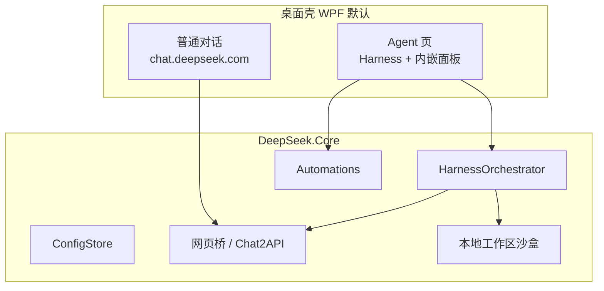

# DeepSeek Desktop

[](https://github.com/fanstars2318/deepseek-desktop)
[](https://github.com/fanstars2318/deepseek-desktop/releases)
[%20%2F%209%20(Core)-512BD4)](https://dotnet.microsoft.com/)

**DeepSeek Desktop** 是一款面向 Windows 的第三方桌面客户端：在 WebView2 中嵌入 [DeepSeek 网页对话](https://chat.deepseek.com)，并提供 **Agent 工作台**、**内嵌 API 管理（Chat2API）**、**MCP 工具** 与 **本地工作区沙盒**。V2 起 Agent 使用仓库内置的 **C# Harness** 编排（ReAct / Blueprint），**无需** 再打包或运行 `deepseek-tui.exe`。

> **免责声明：** 本项目为社区独立作品，与 DeepSeek 官方无隶属关系。详见 [DISCLAIMER.md](./DISCLAIMER.md)。

**GitHub 简介（About）：** Windows 版 DeepSeek 桌面客户端 — 官网聊天 + 进程内 Agent Harness + 汉化 Chat2API + Automations + MCP，一键 `build.ps1` 发布到 `publish/`。

---

## V2.0 新特性

| 能力 | 说明 |
|------|------|
| **原生 Agent Harness** | `DeepSeek.Core/Services/Harness` 进程内编排，工具/MCP/沙盒/Phase 策略统一在 C# 中 |
| **本地工作区沙盒** | DeerFlow 风格虚拟路径（`/mnt/user-data/workspace` 等）+ 懒加载本地沙盒 |
| **Automations** | Agent 页内常驻自动化：定时 / Webhook 触发后台任务 |
| **消息渲染** | Markdown + KaTeX 公式 + 代码高亮（对齐网页版阅读体验） |
| **单一发布目录** | `.\build.ps1` 仅输出到 `publish/`，不再向仓库根 `bin/` 复制发布包 |
| **可选 DeepSeek-TUI** | `third-party/DeepSeek-TUI` 仍可作为参考 submodule，**不是** V2 运行时依赖 |

预编译 Windows x64 包见 [Releases](https://github.com/fanstars2318/deepseek-desktop/releases)（例如 `DeepSeek-Desktop-v2.0.0-win-x64.zip`）。

---

## 功能一览

| 模块 | 说明 |
|------|------|
| **普通对话** | 嵌入 `chat.deepseek.com`，保留登录、深度思考、联网搜索 |
| **Agent** | 侧栏会话、工作区、Execute/Blueprint、思考过程流式展示、Slash 命令 |
| **API 管理** | Agent 内嵌 Chat2API 汉化 UI，与桌面配置同步 |
| **MCP** | 多服务器接入，Harness 工具目录与调用 |
| **设置** | 内嵌设置页：MCP、工作区、Harness、调试日志等 |
| **工作模式** | 普通对话 ↔ Agent 一键切换（网页悬浮钮 + Agent 顶栏） |

---

## 架构（V2）



推理默认经已登录网页会话与 Chat2API 桥接，无需对外暴露 `5111` 端口（除非在设置中手动开启外部 OpenAI API）。

---

## 快速开始

### 环境

- Windows 10 / 11（x64）
- [.NET SDK 10](https://dotnet.microsoft.com/download)（WPF 主壳）
- [WebView2 运行时](https://developer.microsoft.com/microsoft-edge/webview2/)
- 从源码构建 Chat2API UI 时需 [Node.js](https://nodejs.org/)（仓库已附带 `Assets/chat2api/` 构建产物时可跳过）

### 克隆（仅桌面端源码）

```powershell
git clone https://github.com/fanstars2318/deepseek-desktop.git
cd deepseek-desktop
# 可选参考上游 Agent 实现（非 V2 运行时必需）：
# git submodule update --init --recursive
```

### 构建与运行

```powershell
.\build.ps1
.\publish\DeepSeek.exe
```

```powershell
# 全量自检（单元测试 + 集成 + Harness smoke）
.\scripts\test-all.ps1
```

### 首次使用

1. 在 **普通对话** 登录 DeepSeek。  
2. 切换到 **Agent**，选择工作区并发送任务。  
3. 在侧栏打开 **设置** / **API 管理** / **Automations**（按需）。  

---

## 配置与数据

| 路径 | 内容 |
|------|------|
| `%LocalAppData%\deepseek_desktop\config.json` | Token、MCP、模型、功能开关 |
| `%LocalAppData%\deepseek_desktop\agent-sessions\` | Agent 会话与 Harness 状态 |
| `%LocalAppData%\deepseek_desktop\logs\` | 调试日志（可选） |
| `~/.deepseek/` | Skills、部分兼容配置（可选） |

字段定义见 `DeepSeek.Core/Models/AppConfig.cs`。

---

## 仓库结构

```
deepseek-desktop/
├── DeepSeek.Core/           # 业务库：Harness、MCP、Automations、Chat2API
├── DeepSeek.Core.Tests/     # 单元测试
├── DeepSeek.Desktop/        # WinUI 实验壳（build.ps1 -WinUi）
├── DeepSeekBrowser.csproj   # WPF 主壳（默认）
├── Assets/                  # agent、chat2api、inject 静态资源
├── Services/                # WPF 宿主：WebView、AgentHost、注入
├── scripts/                 # 构建与验证脚本
├── docs/                    # 设计说明（如 HARNESS.md）
├── third-party/             # 可选 submodule（DeepSeek-TUI 参考）
└── build.ps1                # 发布到 publish/
```

**不会提交到 Git 的内容：** `publish/`、`bin/`、`obj/`、本地配置与日志（见 `.gitignore`）。

---

## 从源码发布 Release 包

维护者本地生成 zip 并上传 GitHub Release 的示例：

```powershell
.\build.ps1
Compress-Archive -Path .\publish\* -DestinationPath .\DeepSeek-Desktop-v2.0.0-win-x64.zip
gh release create v2.0.0 .\DeepSeek-Desktop-v2.0.0-win-x64.zip --title "v2.0.0" --notes "V2: 原生 Harness、本地沙盒、Automations、公式渲染"
```

---

## 常见问题

**和官方网页有什么区别？**  
本客户端是第三方封装，提供桌面集成、Agent 工作台、MCP 与本地工作区；模型能力仍依赖 DeepSeek 网页账号与会话。

**还需要 DeepSeek-TUI 吗？**  
V2 **不需要**。`third-party/DeepSeek-TUI` 仅作可选参考 submodule。

**发布目录在哪？**  
唯一标准路径：`publish\DeepSeek.exe`（由 `build.ps1` 生成）。

---

## 相关链接

- 仓库：https://github.com/fanstars2318/deepseek-desktop  
- [DeepSeek 官网](https://chat.deepseek.com)  
- [DeepSeek API 文档](https://api-docs.deepseek.com/zh-cn/)  

完整免责条款见 [DISCLAIMER.md](./DISCLAIMER.md)。欢迎 Issue / PR；请勿提交 Token 或私钥。

<p align="center"><sub>如果这个项目对你有帮助，欢迎 Star</sub></p>
