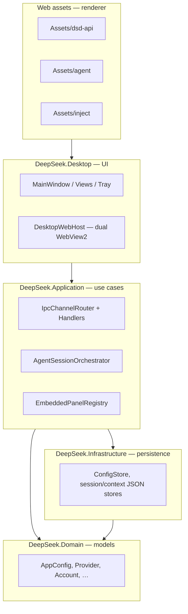

# DeepSeek Desktop — Architecture

This document describes the layered architecture of DeepSeek Desktop (DSD): a **WPF + WebView2** shell with embedded web UIs (Agent, API management console, chat inject scripts) and a **.NET** backend (Harness, DSD API / OpenAI-compatible layer).

## Layer overview

**Dependency rule:** `Desktop → Application → Domain ← Infrastructure`. UI must not contain business rules; persistence must not reference WPF.

## Solution projects

| Project | Path | Role |
|---------|------|------|
| DeepSeek.Desktop | `DeepSeekBrowser.csproj` | WPF shell, WebView2, Services bridge |
| DeepSeek.Application | `src/DeepSeek.Application/` | IPC handlers, embedded panel registry, agent orchestration |
| DeepSeek.Domain | `src/DeepSeek.Domain/` | Domain models (`Models/`) |
| DeepSeek.Infrastructure | `src/DeepSeek.Infrastructure/` | File-backed stores (`Persistence/`) |
| DeepSeek.Core | `DeepSeek.Core/` | Harness, ApiManagement services (transition) |

Open `DeepSeek.slnx` for the full solution.

## Process and thread model (WebView2)

Unlike Electron, **WebView2 renderers run in-process**. Isolation is **logical** via preload whitelists and IPC channels.

| Surface | Role |
|---------|------|
| Main WPF thread | Window, tray, OAuth dialogs |
| Chat WebView2 | DeepSeek web chat + inject scripts |
| Agent WebView2 | Agent UI + embedded API management iframe |
| Thread pool | IPC handlers, file IO, HTTP, Harness runs |

## IPC channel map

Entry: `Services/DsdApiIpcBridge.cs` → `DeepSeek.AppLayer.Ipc.IpcChannelRouter`.

Migrated to Application handlers: `config:*`, `providers:getAll|getBuiltin|checkAllStatus`, `accounts:getAll`, `session:getConfig|updateConfig`, `contextManagement:*`, `statistics:get|getToday`, `logs:getStats`, `requestLogs:getStats`, `managementApi:getConfig`.

All other channels remain in `Services/DsdApiIpcBridge.LegacyDispatch.cs` until extracted.

## Web assets build flow

1. `scripts/build-dsd-api-ui.ps1` → `Assets/dsd-api` (canonical)
2. `scripts/sync-agent-dsd-api.ps1` → `Assets/agent/dsd-api`
3. `dotnet publish` copies Assets into publish dir

See [`web/dsd-api-renderer/README.md`](../web/dsd-api-renderer/README.md).

After UI asset changes, bump `EmbeddedUiBuild` in `DeepSeek.Core/Services/AppNavigation.cs`.

## IPC async and threading

- **UI thread (WPF):** window events, OAuth dialog show/hide, `Dispatcher.Invoke` only for UI mutations.
- **WebView2 callbacks:** keep thin; delegate to `DsdApiIpcBridge.InvokeAsync` or Agent host messages.
- **IPC handlers (`DeepSeek.Application`):** no `System.Windows` references; return DTOs only.
- **IO / HTTP / model sync:** run on thread pool; pass `CancellationToken` from WebView message handler.
- **Long channels:** `oauth:*`, `accounts:validate`, `toolCalling:runSmoke`, `providers:syncModels` — must not block UI; preload uses extended timeout for OAuth/toolCalling only.

When adding a new IPC channel, register a handler under `src/DeepSeek.Application/Ipc/Handlers/` and add a test in `DeepSeek.Application.Tests`.

## Plugin boundary

Custom provider adapters implement `IApiProviderAdapter` in Core/Infrastructure. Future dynamic plugins should load from a dedicated Infrastructure plugin directory — never from WPF or web bundles.

## Related docs

- [CONTRIBUTING.md](../CONTRIBUTING.md)
- [README.md](../README.md)
- [INSTALL.md](./INSTALL.md)
